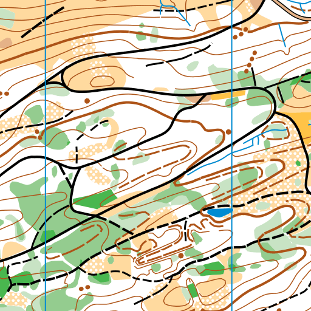

Orienteering Map Style
===========================

This is work in progress to create an orienteering style in Mapbox Studio. Sample data are exported from [OCAD](http://ocad.com/en/) as shapefiles and reprojected in QGIS. Data were exported as points, lines, and polygons with buildings as a separate (top) layer.

Future items on the roadmap:
- add polygon pattern files
- add marker files for complex markers
- add line patterns
- color match

## Symbols

Numbers for all symbols match [ISOM 2000 specification](http://orienteering.org/wp-content/uploads/2010/12/International-Specification-for-Orienteering-Maps-2000_2.pdf) as closely as possible.

|Symbol|Description|
|---|---|
|101| Contour|
|102| Index contour|
|103| Form line|
|104| Slope line|
|105| Contour value|
|106| Earth bank|
|107| Earth wall|
|108| Small earth wall|
|109| Erosion gully|
|110| Small erosion gully|
|111| Knoll|
|112| Small knoll|
|113| Elongated knoll|
|114| Depression|
|115| Small depression|
|116| Pit|
|117| Broken ground|
|118| Special land form feature|
|201| Impassable cliff|
|202| Rock pillars/cliffs|
|203| Passable rock face|
|204| Rocky pit|
|205| Cave|
|206| Boulder|
|207| Large boulder|
|208| Boulder field|
|209| Boulder cluster|
|210| Stony ground|
|211| Open sandy ground|
|212| Bare rock|
|301| Lake|
|302| Pond|
|303| Waterhole|
|304| Uncrossable river|
|305| Crossable watercourse|
|306| Crossable small watercourse|
|307| Minor water channel|
|308| Narrow marsh|
|309| Uncrossable marsh|
|310| Marsh|
|311| Indistinct marsh|
|312| Well|
|313| Spring|
|314| Special water feature|
|401| Open land|
|403| Rough open land|
|402| Open land with scattered trees|
|404| Rough open land with scattered trees|
|405| Forest: easy running|
|406| Forest: slow running|
|407| Undergrowth: slow running|
|408| Forest: difficult to run|
|409| Undergrowth: difficult to run|
|410| Vegetation: very difficult to run impassable|
|411| Forest - |nable| in one direction|
|412| Orchard|
|413| Vineyard|
|414| Distinct cultivation boundary|
|415| Cultivated land|
|416| Distinct vegetation boundary|
|417| Indistinct vegetation boundary|
|419| Special vegetation features|
|420| Special vegetation features|
|501| Motorway|
|502| Major road|
|503| Minor road|
|504| Road|
|505| Vehicle track|
|506| Footpath|
|507| Small path|
|508| Less distinct small path|
|509| Narrow ride|
|510| Visible path junction|
|511| Indistinct junction|
|512| Footbridge|
|513| Crossing point with bridge|
|514| Crossing point without bridge|
|515| Railway|
|516| Power line|
|517| Major power line|
|518| Tunnel|
|519| Stone wall|
|520| Ruined stone wall|
|521| High stone wall|
|522| Fence|
|523| Ruined fence|
|524| High fence|
|525| Crossing point|
|526| Building|
|527| Settlement|
|528| Permanently out of bounds|
|529| Paved area|
|530| Ruin|
|531| Firing range|
|532| Grave|
|533| Crossable pipeline|
|534| Uncrossable pipeline|
|535| High tower|
|536| Small tower|
|537| Cairn|
|538| Fodder rack|
|540| Special man-made features|
|601| Magnetic north line|
|602| Registration marks|
|603| Spot height|
|701| Start|
|702| Control point|
|703| Control number|
|704| Line|
|705| Marked route|
|706| Finish|
|707| Uncrossable boundary|
|708| Crossing point|
|709| Out-of-bounds area|
|710| Dangerous area|
|711| Forbidden route|
|712| First aid post|
|713| Refreshment point|
